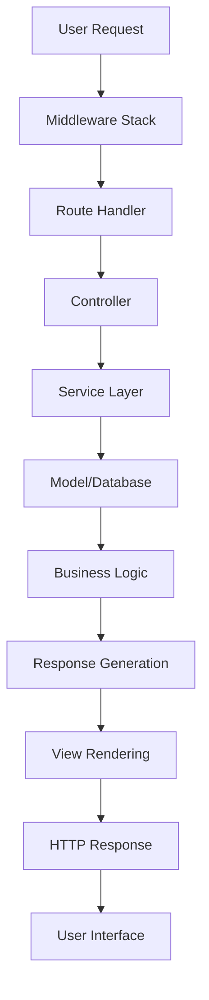

# PRAKTIKUM 04: FEATURE TESTING DALAM LARAVEL
## Testing Complete User Workflows dengan Laravel Feature Tests

### **Informasi Modul**
- **Mata Kuliah**: Rekayasa Perangkat Lunak / Software Testing
- **Topik**: Feature Testing - Complete User Workflow Testing
- **Framework**: Laravel 10/11 dengan PHPUnit
- **Durasi**: 120 menit (2 jam)
- **Level**: Intermediate to Advanced

> **📋 MODULES SERIES**:  
> **[MODUL_PRAKTIKUM_UNIT_TESTING.md](./MODUL_PRAKTIKUM_UNIT_TESTING.md)** → **[MODUL_PRAKTIKUM_INTEGRATION_TESTING.md](./MODUL_PRAKTIKUM_INTEGRATION_TESTING.md)** → **[MODUL_PRAKTIKUM_API_TESTING.md](./MODUL_PRAKTIKUM_API_TESTING.md)** → **MODUL_PRAKTIKUM_FEATURE_TESTING.md** ← *You are here*

---

## **TUJUAN PEMBELAJARAN**

Setelah menyelesaikan praktikum Feature Testing ini, mahasiswa diharapkan mampu:

1. **Memahami konsep Feature Testing** dan posisinya dalam testing pyramid
2. **Mengimplementasikan complete user workflow testing** dari perspektif end-user
3. **Menguji user authentication workflows** (login, register, logout)
4. **Melakukan web form testing** dengan validation dan error handling
5. **Menggunakan Laravel Browser Testing** untuk user interaction simulation
6. **Mengimplementasikan database state testing** dalam feature workflows
7. **Menguji authorization dan permission workflows** untuk different user roles
8. **Menganalisis feature test coverage** untuk business requirements

---

## **PENDAHULUAN**

### **Apa itu Feature Testing?**

**Feature Testing** adalah pengujian complete user workflows yang menguji **end-to-end functionality** dari perspektif user. Feature tests memastikan bahwa semua components bekerja bersama untuk deliver expected user experience.

#### **🎯 Karakteristik Feature Testing**

- ✅ **User-Centric**: Testing dari perspektif end-user
- ✅ **Workflow-Based**: Testing complete business processes
- ✅ **Multi-Layer**: Testing melibatkan HTTP, Database, Views, Controllers
- ✅ **State-Aware**: Testing perubahan state aplikasi
- ✅ **Business-Focused**: Testing business requirements dan use cases

### **Feature Testing vs Other Testing Types**

```
🔹 Unit Testing        → Isolated components (no HTTP, no DB)
🔹 Integration         → Component interactions (no HTTP)  
🔹 API Testing         → HTTP API endpoints (JSON responses)
🔹 Feature Testing     → Complete user workflows (HTML + DB + Session) 🎯
🔹 Browser Testing     → Real browser automation (Selenium/Dusk)
🔹 E2E Testing         → Full application journeys (multiple features)
```

### **Feature Testing dalam Modern Web Development**

Modern web applications membutuhkan **comprehensive feature testing** karena:

#### **🏗️ Complex Application Architecture**



#### **📊 Testing Pyramid untuk Web Applications**

```
       /\     E2E Tests (Few, Slow, Expensive)
      /  \    Browser Tests (Some, Medium, Realistic)
     /____\   Feature Tests (Many, Fast, Comprehensive) 🎯
    /______\  API Tests (Many, Fast, Contract-focused)
   /________\ Integration Tests (Many, Medium, Component-focused)
  /__________\ Unit Tests (Most, Fastest, Isolated)
```

#### **💼 Business Value dari Feature Testing**

| **Aspek** | **Value Proposition** |
|-----------|----------------------|
| **User Experience** | Memastikan workflows berjalan smooth dari user perspective |
| **Business Logic** | Validasi business rules dan requirements |
| **Integration Confidence** | Confidence bahwa semua components bekerja together |
| **Regression Prevention** | Mendeteksi breaking changes dalam user workflows |
| **Documentation** | Feature tests sebagai living documentation |

---

## **DASAR TEORI FEATURE TESTING**

### **1. Laravel Feature Testing Fundamentals**

#### **🏛️ Laravel Testing Architecture**

```php
// Laravel Feature Test Structure
tests/
├── Feature/
│   ├── Auth/
│   │   ├── LoginTest.php
│   │   ├── RegisterTest.php
│   │   └── LogoutTest.php
│   ├── Branch/
│   │   ├── BranchManagementTest.php
│   │   ├── BranchCreateTest.php
│   │   └── BranchUpdateTest.php
│   └── UserManagement/
│       ├── UserProfileTest.php
│       └── UserPermissionTest.php
└── TestCase.php
```

#### **🔧 Laravel Feature Testing Tools**

```php
// Base Feature Test Class
<?php

namespace Tests\Feature;

use Tests\TestCase;
use Illuminate\Foundation\Testing\RefreshDatabase;
use Illuminate\Foundation\Testing\WithFaker;

abstract class BaseFeatureTest extends TestCase
{
    use RefreshDatabase, WithFaker;
    
    protected function setUp(): void
    {
        parent::setUp();
        
        // Initialize test database
        $this->artisan('migrate');
        
        // Seed essential data
        $this->seed([
            \Database\Seeders\RoleSeeder::class,
            \Database\Seeders\PermissionSeeder::class
        ]);
    }
    
    protected function authenticateUser($role = 'admin')
    {
        $user = \App\Models\User::factory()->create();
        $user->assignRole($role);
        
        return $this->actingAs($user);
    }
    
    protected function assertDatabaseContains($table, $data)
    {
        $this->assertDatabaseHas($table, $data);
    }
    
    protected function assertViewContains($response, $text)
    {
        $response->assertSee($text);
    }
}
```

### **2. HTTP Request/Response Testing**

#### **🌐 Web Request Testing**

```php
// tests/Feature/Branch/BranchCreateTest.php
<?php

namespace Tests\Feature\Branch;

use Tests\Feature\BaseFeatureTest;
use App\Models\User;
use App\Models\Branch;

class BranchCreateTest extends BaseFeatureTest
{
    public function test_authenticated_user_can_view_branch_create_form()
    {
        // Arrange
        $this->authenticateUser('admin');
        
        // Act
        $response = $this->get('/branches/create');
        
        // Assert
        $response->assertStatus(200)
            ->assertViewIs('branches.create')
            ->assertSee('Create New Branch')
            ->assertSee('Branch Name')
            ->assertSee('Address')
            ->assertSee('Telephone');
    }
    
    public function test_guest_user_cannot_access_branch_create_form()
    {
        // Act
        $response = $this->get('/branches/create');
        
        // Assert
        $response->assertRedirect('/login');
    }
    
    public function test_user_can_create_branch_with_valid_data()
    {
        // Arrange
        $this->authenticateUser('admin');
        $branchData = [
            'name' => 'Cabang Jakarta Selatan',
            'address' => 'Jl. Sudirman No. 123, Jakarta Selatan',
            'telephone' => '021-87654321'
        ];
        
        // Act
        $response = $this->post('/branches', $branchData);
        
        // Assert
        $response->assertRedirect('/branches')
            ->assertSessionHas('success', 'Branch created successfully');
            
        $this->assertDatabaseHas('branches', $branchData);
        
        // Verify branch was actually created
        $branch = Branch::where('name', $branchData['name'])->first();
        $this->assertNotNull($branch);
        $this->assertEquals($branchData['address'], $branch->address);
    }
    
    public function test_branch_creation_fails_with_invalid_data()
    {
        // Arrange
        $this->authenticateUser('admin');
        $invalidData = [
            'name' => '', // Required field empty
            'address' => str_repeat('a', 256), // Too long
            'telephone' => 'invalid-phone' // Invalid format
        ];
        
        // Act
        $response = $this->post('/branches', $invalidData);
        
        // Assert
        $response->assertStatus(302) // Redirect back with errors
            ->assertSessionHasErrors(['name', 'address', 'telephone']);
            
        $this->assertDatabaseMissing('branches', ['name' => '']);
    }
}
```

### **3. Authentication Workflow Testing**

#### **🔐 Complete Authentication Feature Tests**

```php
// tests/Feature/Auth/LoginTest.php
<?php

namespace Tests\Feature\Auth;

use Tests\Feature\BaseFeatureTest;
use App\Models\User;
use Illuminate\Support\Facades\Hash;

class LoginTest extends BaseFeatureTest
{
    public function test_login_page_displays_correctly()
    {
        // Act
        $response = $this->get('/login');
        
        // Assert
        $response->assertStatus(200)
            ->assertViewIs('auth.login')
            ->assertSee('Email')
            ->assertSee('Password')
            ->assertSee('Remember Me')
            ->assertSee('Login');
    }
    
    public function test_user_can_login_with_valid_credentials()
    {
        // Arrange
        $user = User::factory()->create([
            'email' => 'test@example.com',
            'password' => Hash::make('password123')
        ]);
        
        // Act
        $response = $this->post('/login', [
            'email' => 'test@example.com',
            'password' => 'password123'
        ]);
        
        // Assert
        $response->assertRedirect('/dashboard');
        $this->assertAuthenticatedAs($user);
        
        // Follow redirect and check dashboard
        $dashboardResponse = $this->get('/dashboard');
        $dashboardResponse->assertStatus(200)
            ->assertSee('Welcome, ' . $user->name);
    }
    
    public function test_user_cannot_login_with_invalid_credentials()
    {
        // Arrange
        User::factory()->create([
            'email' => 'test@example.com',
            'password' => Hash::make('correctpassword')
        ]);
        
        // Act
        $response = $this->post('/login', [
            'email' => 'test@example.com',
            'password' => 'wrongpassword'
        ]);
        
        // Assert
        $response->assertStatus(302)
            ->assertSessionHasErrors('email');
        $this->assertGuest();
    }
    
    public function test_remember_me_functionality_works()
    {
        // Arrange
        $user = User::factory()->create([
            'email' => 'test@example.com',
            'password' => Hash::make('password123')
        ]);
        
        // Act
        $response = $this->post('/login', [
            'email' => 'test@example.com',
            'password' => 'password123',
            'remember' => true
        ]);
        
        // Assert
        $response->assertRedirect('/dashboard');
        $this->assertAuthenticatedAs($user);
        
        // Check remember token was set
        $user->refresh();
        $this->assertNotNull($user->remember_token);
    }
    
    public function test_user_is_redirected_to_intended_page_after_login()
    {
        // Arrange
        $user = User::factory()->create();
        
        // Act - try to access protected page
        $protectedResponse = $this->get('/admin/users');
        $protectedResponse->assertRedirect('/login');
        
        // Login
        $loginResponse = $this->post('/login', [
            'email' => $user->email,
            'password' => 'password'
        ]);
        
        // Assert - redirected to intended page
        $loginResponse->assertRedirect('/admin/users');
    }
}
```

### **4. Form Validation and Error Handling**

#### **📝 Comprehensive Form Testing**

```php
// tests/Feature/Branch/BranchValidationTest.php
<?php

namespace Tests\Feature\Branch;

use Tests\Feature\BaseFeatureTest;

class BranchValidationTest extends BaseFeatureTest
{
    public function test_branch_name_is_required()
    {
        // Arrange
        $this->authenticateUser('admin');
        
        // Act
        $response = $this->post('/branches', [
            'name' => '',
            'address' => 'Valid Address',
            'telephone' => '021-12345678'
        ]);
        
        // Assert
        $response->assertSessionHasErrors('name')
            ->assertSessionHasErrorsIn('default', [
                'name' => 'The name field is required.'
            ]);
    }
    
    public function test_branch_name_has_maximum_length()
    {
        // Arrange
        $this->authenticateUser('admin');
        $longName = str_repeat('a', 101); // Assuming max is 100
        
        // Act
        $response = $this->post('/branches', [
            'name' => $longName,
            'address' => 'Valid Address',
            'telephone' => '021-12345678'
        ]);
        
        // Assert
        $response->assertSessionHasErrors('name');
    }
    
    public function test_telephone_format_validation()
    {
        // Arrange
        $this->authenticateUser('admin');
        
        $invalidPhones = [
            'abc123',
            '123',
            '++--123',
            'phone-number'
        ];
        
        foreach ($invalidPhones as $invalidPhone) {
            // Act
            $response = $this->post('/branches', [
                'name' => 'Test Branch',
                'address' => 'Test Address',
                'telephone' => $invalidPhone
            ]);
            
            // Assert
            $response->assertSessionHasErrors('telephone');
        }
    }
    
    public function test_duplicate_branch_name_validation()
    {
        // Arrange
        $this->authenticateUser('admin');
        
        // Create existing branch
        \App\Models\Branch::factory()->create([
            'name' => 'Existing Branch'
        ]);
        
        // Act - try to create branch with same name
        $response = $this->post('/branches', [
            'name' => 'Existing Branch',
            'address' => 'Different Address',
            'telephone' => '021-87654321'
        ]);
        
        // Assert
        $response->assertSessionHasErrors('name')
            ->assertSessionHasErrorsIn('default', [
                'name' => 'The name has already been taken.'
            ]);
    }
    
    public function test_validation_errors_are_displayed_on_form()
    {
        // Arrange
        $this->authenticateUser('admin');
        
        // Act
        $response = $this->post('/branches', [
            'name' => '',
            'address' => '',
            'telephone' => 'invalid'
        ]);
        
        // Follow redirect back to form
        $formResponse = $this->get('/branches/create');
        
        // Assert
        $formResponse->assertStatus(200)
            ->assertSee('The name field is required.')
            ->assertSee('The address field is required.')
            ->assertSee('The telephone format is invalid.');
    }
}
```

### **5. Database State Testing**

#### **🗄️ Database Transaction Testing**

```php
// tests/Feature/Branch/BranchDatabaseTest.php
<?php

namespace Tests\Feature\Branch;

use Tests\Feature\BaseFeatureTest;
use App\Models\Branch;
use App\Models\User;

class BranchDatabaseTest extends BaseFeatureTest
{
    public function test_branch_creation_updates_database_correctly()
    {
        // Arrange
        $this->authenticateUser('admin');
        $initialCount = Branch::count();
        
        $branchData = [
            'name' => 'New Branch',
            'address' => 'New Address',
            'telephone' => '021-11111111'
        ];
        
        // Act
        $response = $this->post('/branches', $branchData);
        
        // Assert
        $this->assertEquals($initialCount + 1, Branch::count());
        
        $branch = Branch::latest()->first();
        $this->assertEquals($branchData['name'], $branch->name);
        $this->assertEquals($branchData['address'], $branch->address);
        $this->assertEquals($branchData['telephone'], $branch->telephone);
        $this->assertNotNull($branch->created_at);
        $this->assertNotNull($branch->updated_at);
    }
    
    public function test_branch_update_modifies_existing_record()
    {
        // Arrange
        $this->authenticateUser('admin');
        $branch = Branch::factory()->create([
            'name' => 'Original Name'
        ]);
        
        $updateData = [
            'name' => 'Updated Name',
            'address' => 'Updated Address',
            'telephone' => '021-99999999'
        ];
        
        // Act
        $response = $this->put("/branches/{$branch->id}", $updateData);
        
        // Assert
        $branch->refresh();
        $this->assertEquals($updateData['name'], $branch->name);
        $this->assertEquals($updateData['address'], $branch->address);
        $this->assertEquals($updateData['telephone'], $branch->telephone);
        $this->assertTrue($branch->updated_at->greaterThan($branch->created_at));
    }
    
    public function test_branch_deletion_removes_from_database()
    {
        // Arrange
        $this->authenticateUser('admin');
        $branch = Branch::factory()->create();
        $branchId = $branch->id;
        
        // Act
        $response = $this->delete("/branches/{$branchId}");
        
        // Assert
        $this->assertDatabaseMissing('branches', ['id' => $branchId]);
        $this->assertNull(Branch::find($branchId));
    }
    
    public function test_branch_soft_delete_functionality()
    {
        // Arrange (assuming Branch uses SoftDeletes)
        $this->authenticateUser('admin');
        $branch = Branch::factory()->create();
        
        // Act
        $response = $this->delete("/branches/{$branch->id}");
        
        // Assert
        $this->assertSoftDeleted('branches', ['id' => $branch->id]);
        
        // Verify branch is not in normal queries
        $this->assertNull(Branch::find($branch->id));
        
        // But exists in trashed
        $this->assertNotNull(Branch::withTrashed()->find($branch->id));
    }
}
```

### **6. Authorization and Permission Testing**

#### **🛡️ Role-Based Access Control Testing**

```php
// tests/Feature/Auth/AuthorizationTest.php
<?php

namespace Tests\Feature\Auth;

use Tests\Feature\BaseFeatureTest;
use App\Models\User;
use Spatie\Permission\Models\Role;

class AuthorizationTest extends BaseFeatureTest
{
    public function test_admin_can_access_all_branch_operations()
    {
        // Arrange
        $admin = $this->authenticateUser('admin');
        $branch = \App\Models\Branch::factory()->create();
        
        // Act & Assert
        $this->get('/branches')->assertStatus(200);
        $this->get('/branches/create')->assertStatus(200);
        $this->get("/branches/{$branch->id}")->assertStatus(200);
        $this->get("/branches/{$branch->id}/edit")->assertStatus(200);
    }
    
    public function test_manager_has_limited_branch_access()
    {
        // Arrange
        $manager = $this->authenticateUser('manager');
        $branch = \App\Models\Branch::factory()->create();
        
        // Act & Assert
        $this->get('/branches')->assertStatus(200); // Can view
        $this->get("/branches/{$branch->id}")->assertStatus(200); // Can view details
        $this->get('/branches/create')->assertStatus(403); // Cannot create
        $this->get("/branches/{$branch->id}/edit")->assertStatus(403); // Cannot edit
    }
    
    public function test_employee_cannot_access_branch_management()
    {
        // Arrange
        $employee = $this->authenticateUser('employee');
        $branch = \App\Models\Branch::factory()->create();
        
        // Act & Assert
        $this->get('/branches')->assertStatus(403);
        $this->get('/branches/create')->assertStatus(403);
        $this->get("/branches/{$branch->id}")->assertStatus(403);
        $this->get("/branches/{$branch->id}/edit")->assertStatus(403);
    }
    
    public function test_user_can_only_edit_own_profile()
    {
        // Arrange
        $user1 = User::factory()->create();
        $user2 = User::factory()->create();
        $this->actingAs($user1);
        
        // Act & Assert
        $this->get("/users/{$user1->id}/edit")->assertStatus(200); // Own profile
        $this->get("/users/{$user2->id}/edit")->assertStatus(403); // Other's profile
    }
    
    public function test_permission_specific_functionality()
    {
        // Arrange
        $user = User::factory()->create();
        $user->givePermissionTo('create branches');
        $this->actingAs($user);
        
        // Act & Assert
        $this->get('/branches/create')->assertStatus(200);
        
        // Remove permission
        $user->revokePermissionTo('create branches');
        
        // Act & Assert
        $this->get('/branches/create')->assertStatus(403);
    }
}
```

---

## **PRAKTIKUM: IMPLEMENTASI FEATURE TESTING**

### **📋 Phase 1: Setup dan Konfigurasi (25 menit)**

#### **Step 1: Prepare Testing Environment**

```bash
# 1. Ensure proper testing configuration
php artisan config:clear
php artisan cache:clear

# 2. Create testing database
touch database/testing.sqlite

# 3. Run migrations for testing
php artisan migrate --env=testing

# 4. Install required packages (if not already installed)
composer require --dev laravel/dusk
composer require --dev spatie/laravel-permission
```

#### **Step 2: Create Base Feature Test Class**

```php
// tests/Feature/BaseFeatureTest.php
<?php

namespace Tests\Feature;

use Tests\TestCase;
use Illuminate\Foundation\Testing\RefreshDatabase;
use Illuminate\Foundation\Testing\WithFaker;
use App\Models\User;
use Spatie\Permission\Models\Role;
use Spatie\Permission\Models\Permission;

abstract class BaseFeatureTest extends TestCase
{
    use RefreshDatabase, WithFaker;
    
    protected function setUp(): void
    {
        parent::setUp();
        
        $this->withoutExceptionHandling(); // For debugging
        
        // Seed roles and permissions
        $this->setupRolesAndPermissions();
    }
    
    protected function setupRolesAndPermissions()
    {
        // Create roles
        Role::create(['name' => 'admin']);
        Role::create(['name' => 'manager']);
        Role::create(['name' => 'employee']);
        
        // Create permissions
        Permission::create(['name' => 'create branches']);
        Permission::create(['name' => 'edit branches']);
        Permission::create(['name' => 'delete branches']);
        Permission::create(['name' => 'view branches']);
        
        // Assign permissions to roles
        $admin = Role::findByName('admin');
        $admin->givePermissionTo(['create branches', 'edit branches', 'delete branches', 'view branches']);
        
        $manager = Role::findByName('manager');
        $manager->givePermissionTo(['view branches']);
        
        // Employee has no branch permissions
    }
    
    protected function authenticateUser($role = 'admin')
    {
        $user = User::factory()->create();
        $user->assignRole($role);
        
        return $this->actingAs($user);
    }
    
    protected function assertViewContains($response, $text)
    {
        $response->assertSee($text);
        return $this;
    }
    
    protected function assertRedirectWithMessage($response, $route, $message)
    {
        $response->assertRedirect($route)
            ->assertSessionHas('success', $message);
        return $this;
    }
}
```

#### **Step 3: Configure Testing Environment**

```php
// config/database.php - Update testing configuration
'testing' => [
    'driver' => 'sqlite',
    'database' => database_path('testing.sqlite'),
    'prefix' => '',
    'foreign_key_constraints' => true,
],
```

```php
// phpunit.xml - Ensure proper test environment
<env name="APP_ENV" value="testing"/>
<env name="DB_CONNECTION" value="testing"/>
<env name="DB_DATABASE" value=":memory:"/>
<env name="CACHE_DRIVER" value="array"/>
<env name="QUEUE_CONNECTION" value="sync"/>
<env name="SESSION_DRIVER" value="array"/>
```

### **📋 Phase 2: Authentication Feature Testing (30 menit)**

#### **Step 4: Create Login Feature Tests**

```php
// tests/Feature/Auth/LoginFeatureTest.php
<?php

namespace Tests\Feature\Auth;

use Tests\Feature\BaseFeatureTest;
use App\Models\User;
use Illuminate\Support\Facades\Hash;

class LoginFeatureTest extends BaseFeatureTest
{
    public function test_login_page_renders_correctly()
    {
        $response = $this->get('/login');
        
        $response->assertStatus(200)
            ->assertViewIs('auth.login')
            ->assertSee('Login')
            ->assertSee('Email Address')
            ->assertSee('Password')
            ->assertSee('Remember Me');
    }
    
    public function test_successful_login_workflow()
    {
        // Create user
        $user = User::factory()->create([
            'email' => 'test@example.com',
            'password' => Hash::make('password123'),
            'name' => 'Test User'
        ]);
        
        // Attempt login
        $response = $this->post('/login', [
            'email' => 'test@example.com',
            'password' => 'password123'
        ]);
        
        // Verify successful login
        $response->assertRedirect('/dashboard');
        $this->assertAuthenticatedAs($user);
        
        // Check dashboard access
        $dashboardResponse = $this->get('/dashboard');
        $dashboardResponse->assertStatus(200)
            ->assertSee('Welcome, Test User')
            ->assertSee('Dashboard');
    }
    
    public function test_failed_login_workflow()
    {
        User::factory()->create([
            'email' => 'test@example.com',
            'password' => Hash::make('correctpassword')
        ]);
        
        $response = $this->post('/login', [
            'email' => 'test@example.com',
            'password' => 'wrongpassword'
        ]);
        
        $response->assertRedirect('/')
            ->assertSessionHasErrors('email');
        $this->assertGuest();
    }
    
    public function test_logout_workflow()
    {
        $user = User::factory()->create();
        $this->actingAs($user);
        
        // Verify user is authenticated
        $this->assertAuthenticated();
        
        // Logout
        $response = $this->post('/logout');
        
        // Verify logout
        $response->assertRedirect('/');
        $this->assertGuest();
        
        // Try to access protected page
        $protectedResponse = $this->get('/dashboard');
        $protectedResponse->assertRedirect('/login');
    }
}
```

#### **Step 5: Create Registration Feature Tests**

```php
// tests/Feature/Auth/RegistrationFeatureTest.php
<?php

namespace Tests\Feature\Auth;

use Tests\Feature\BaseFeatureTest;
use App\Models\User;

class RegistrationFeatureTest extends BaseFeatureTest
{
    public function test_registration_page_renders_correctly()
    {
        $response = $this->get('/register');
        
        $response->assertStatus(200)
            ->assertViewIs('auth.register')
            ->assertSee('Register')
            ->assertSee('Name')
            ->assertSee('Email Address')
            ->assertSee('Password')
            ->assertSee('Confirm Password');
    }
    
    public function test_successful_registration_workflow()
    {
        $userData = [
            'name' => 'John Doe',
            'email' => 'john@example.com',
            'password' => 'password123',
            'password_confirmation' => 'password123'
        ];
        
        $response = $this->post('/register', $userData);
        
        // Verify redirect to dashboard
        $response->assertRedirect('/dashboard');
        
        // Verify user was created
        $this->assertDatabaseHas('users', [
            'name' => 'John Doe',
            'email' => 'john@example.com'
        ]);
        
        // Verify user is authenticated
        $user = User::where('email', 'john@example.com')->first();
        $this->assertAuthenticatedAs($user);
        
        // Check dashboard access
        $dashboardResponse = $this->get('/dashboard');
        $dashboardResponse->assertSee('Welcome, John Doe');
    }
    
    public function test_registration_validation_errors()
    {
        // Test with invalid data
        $response = $this->post('/register', [
            'name' => '',
            'email' => 'invalid-email',
            'password' => '123', // Too short
            'password_confirmation' => '456' // Doesn't match
        ]);
        
        $response->assertSessionHasErrors([
            'name', 'email', 'password'
        ]);
        
        // Verify no user was created
        $this->assertEquals(0, User::count());
    }
    
    public function test_duplicate_email_registration()
    {
        // Create existing user
        User::factory()->create(['email' => 'existing@example.com']);
        
        $response = $this->post('/register', [
            'name' => 'New User',
            'email' => 'existing@example.com',
            'password' => 'password123',
            'password_confirmation' => 'password123'
        ]);
        
        $response->assertSessionHasErrors('email');
        $this->assertEquals(1, User::count()); // Still only one user
    }
}
```

### **📋 Phase 3: CRUD Feature Testing (35 menit)**

#### **Step 6: Create Branch CRUD Feature Tests**

```php
// tests/Feature/Branch/BranchCrudFeatureTest.php
<?php

namespace Tests\Feature\Branch;

use Tests\Feature\BaseFeatureTest;
use App\Models\Branch;

class BranchCrudFeatureTest extends BaseFeatureTest
{
    public function test_branch_index_page_workflow()
    {
        $this->authenticateUser('admin');
        
        // Create some branches
        $branches = Branch::factory()->count(3)->create();
        
        $response = $this->get('/branches');
        
        $response->assertStatus(200)
            ->assertViewIs('branches.index')
            ->assertSee('Branch Management')
            ->assertSee('Create New Branch');
            
        // Verify all branches are displayed
        foreach ($branches as $branch) {
            $response->assertSee($branch->name)
                ->assertSee($branch->address);
        }
    }
    
    public function test_branch_create_workflow()
    {
        $this->authenticateUser('admin');
        
        // Step 1: Access create form
        $createResponse = $this->get('/branches/create');
        $createResponse->assertStatus(200)
            ->assertViewIs('branches.create')
            ->assertSee('Create New Branch')
            ->assertSee('Branch Name')
            ->assertSee('Address')
            ->assertSee('Telephone');
        
        // Step 2: Submit form with valid data
        $branchData = [
            'name' => 'Cabang Jakarta Pusat',
            'address' => 'Jl. Thamrin No. 1, Jakarta Pusat',
            'telephone' => '021-12345678'
        ];
        
        $storeResponse = $this->post('/branches', $branchData);
        
        // Step 3: Verify redirect and success message
        $storeResponse->assertRedirect('/branches')
            ->assertSessionHas('success', 'Branch created successfully');
        
        // Step 4: Verify database storage
        $this->assertDatabaseHas('branches', $branchData);
        
        // Step 5: Follow redirect and verify branch appears in list
        $indexResponse = $this->get('/branches');
        $indexResponse->assertSee($branchData['name'])
            ->assertSee($branchData['address']);
    }
    
    public function test_branch_show_workflow()
    {
        $this->authenticateUser('admin');
        $branch = Branch::factory()->create([
            'name' => 'Test Branch',
            'address' => 'Test Address',
            'telephone' => '021-11111111'
        ]);
        
        $response = $this->get("/branches/{$branch->id}");
        
        $response->assertStatus(200)
            ->assertViewIs('branches.show')
            ->assertSee($branch->name)
            ->assertSee($branch->address)
            ->assertSee($branch->telephone)
            ->assertSee('Edit Branch')
            ->assertSee('Delete Branch');
    }
    
    public function test_branch_edit_workflow()
    {
        $this->authenticateUser('admin');
        $branch = Branch::factory()->create([
            'name' => 'Original Name'
        ]);
        
        // Step 1: Access edit form
        $editResponse = $this->get("/branches/{$branch->id}/edit");
        $editResponse->assertStatus(200)
            ->assertViewIs('branches.edit')
            ->assertSee('Edit Branch')
            ->assertSee($branch->name);
        
        // Step 2: Submit update
        $updateData = [
            'name' => 'Updated Branch Name',
            'address' => 'Updated Address',
            'telephone' => '021-99999999'
        ];
        
        $updateResponse = $this->put("/branches/{$branch->id}", $updateData);
        
        // Step 3: Verify redirect and success
        $updateResponse->assertRedirect('/branches')
            ->assertSessionHas('success', 'Branch updated successfully');
        
        // Step 4: Verify database update
        $this->assertDatabaseHas('branches', $updateData);
        
        // Step 5: Verify old data is gone
        $this->assertDatabaseMissing('branches', [
            'name' => 'Original Name'
        ]);
    }
    
    public function test_branch_delete_workflow()
    {
        $this->authenticateUser('admin');
        $branch = Branch::factory()->create();
        $branchId = $branch->id;
        
        // Step 1: Delete branch
        $deleteResponse = $this->delete("/branches/{$branchId}");
        
        // Step 2: Verify redirect and success message
        $deleteResponse->assertRedirect('/branches')
            ->assertSessionHas('success', 'Branch deleted successfully');
        
        // Step 3: Verify branch is removed from database
        $this->assertDatabaseMissing('branches', ['id' => $branchId]);
        
        // Step 4: Verify branch no longer appears in index
        $indexResponse = $this->get('/branches');
        $indexResponse->assertDontSee($branch->name);
        
        // Step 5: Verify accessing deleted branch returns 404
        $showResponse = $this->get("/branches/{$branchId}");
        $showResponse->assertStatus(404);
    }
}
```

#### **Step 7: Create Form Validation Feature Tests**

```php
// tests/Feature/Branch/BranchValidationFeatureTest.php
<?php

namespace Tests\Feature\Branch;

use Tests\Feature\BaseFeatureTest;
use App\Models\Branch;

class BranchValidationFeatureTest extends BaseFeatureTest
{
    public function test_complete_validation_error_workflow()
    {
        $this->authenticateUser('admin');
        
        // Step 1: Submit form with all invalid data
        $invalidData = [
            'name' => '', // Required
            'address' => str_repeat('a', 300), // Too long
            'telephone' => 'invalid-phone' // Invalid format
        ];
        
        $response = $this->post('/branches', $invalidData);
        
        // Step 2: Verify redirect back with errors
        $response->assertRedirect()
            ->assertSessionHasErrors(['name', 'address', 'telephone']);
        
        // Step 3: Follow redirect to create form
        $createResponse = $this->get('/branches/create');
        
        // Step 4: Verify error messages are displayed
        $createResponse->assertStatus(200)
            ->assertSee('The name field is required')
            ->assertSee('The address may not be greater than')
            ->assertSee('The telephone format is invalid');
        
        // Step 5: Verify old input is preserved (except sensitive fields)
        $createResponse->assertSee($invalidData['address']) // Old input preserved
            ->assertSee($invalidData['telephone']); // Old input preserved
    }
    
    public function test_partial_form_correction_workflow()
    {
        $this->authenticateUser('admin');
        
        // Step 1: Submit with some errors
        $partiallyInvalidData = [
            'name' => 'Valid Name',
            'address' => '', // Invalid
            'telephone' => '021-12345678' // Valid
        ];
        
        $response = $this->post('/branches', $partiallyInvalidData);
        $response->assertSessionHasErrors(['address'])
            ->assertSessionHasNoErrors(['name', 'telephone']);
        
        // Step 2: Correct the error and resubmit
        $correctedData = [
            'name' => 'Valid Name',
            'address' => 'Valid Address',
            'telephone' => '021-12345678'
        ];
        
        $correctedResponse = $this->post('/branches', $correctedData);
        
        // Step 3: Verify successful creation
        $correctedResponse->assertRedirect('/branches')
            ->assertSessionHas('success');
        
        $this->assertDatabaseHas('branches', $correctedData);
    }
    
    public function test_unique_constraint_validation_workflow()
    {
        $this->authenticateUser('admin');
        
        // Step 1: Create existing branch
        $existingBranch = Branch::factory()->create([
            'name' => 'Existing Branch'
        ]);
        
        // Step 2: Try to create branch with same name
        $duplicateData = [
            'name' => 'Existing Branch',
            'address' => 'Different Address',
            'telephone' => '021-87654321'
        ];
        
        $response = $this->post('/branches', $duplicateData);
        
        // Step 3: Verify unique validation error
        $response->assertSessionHasErrors(['name']);
        
        // Step 4: Verify error message is specific
        $createResponse = $this->get('/branches/create');
        $createResponse->assertSee('The name has already been taken');
        
        // Step 5: Verify only original branch exists
        $this->assertEquals(1, Branch::where('name', 'Existing Branch')->count());
    }
}
```

### **📋 Phase 4: Authorization Feature Testing (30 menit)**

#### **Step 8: Create Role-Based Access Feature Tests**

```php
// tests/Feature/Auth/RoleBasedAccessFeatureTest.php
<?php

namespace Tests\Feature\Auth;

use Tests\Feature\BaseFeatureTest;
use App\Models\Branch;

class RoleBasedAccessFeatureTest extends BaseFeatureTest
{
    public function test_admin_complete_access_workflow()
    {
        $this->authenticateUser('admin');
        $branch = Branch::factory()->create();
        
        // Admin can access all pages
        $this->get('/branches')->assertStatus(200);
        $this->get('/branches/create')->assertStatus(200);
        $this->get("/branches/{$branch->id}")->assertStatus(200);
        $this->get("/branches/{$branch->id}/edit")->assertStatus(200);
        
        // Admin can perform all actions
        $createResponse = $this->post('/branches', [
            'name' => 'Admin Created Branch',
            'address' => 'Admin Address',
            'telephone' => '021-11111111'
        ]);
        $createResponse->assertRedirect('/branches');
        
        $updateResponse = $this->put("/branches/{$branch->id}", [
            'name' => 'Admin Updated Branch',
            'address' => 'Updated Address',
            'telephone' => '021-22222222'
        ]);
        $updateResponse->assertRedirect('/branches');
        
        $deleteResponse = $this->delete("/branches/{$branch->id}");
        $deleteResponse->assertRedirect('/branches');
    }
    
    public function test_manager_limited_access_workflow()
    {
        $this->authenticateUser('manager');
        $branch = Branch::factory()->create();
        
        // Manager can view but not modify
        $this->get('/branches')->assertStatus(200);
        $this->get("/branches/{$branch->id}")->assertStatus(200);
        
        // Manager cannot access create/edit forms
        $this->get('/branches/create')->assertStatus(403);
        $this->get("/branches/{$branch->id}/edit")->assertStatus(403);
        
        // Manager cannot perform create/update/delete actions
        $createResponse = $this->post('/branches', [
            'name' => 'Manager Attempted Branch',
            'address' => 'Manager Address',
            'telephone' => '021-33333333'
        ]);
        $createResponse->assertStatus(403);
        
        $updateResponse = $this->put("/branches/{$branch->id}", [
            'name' => 'Manager Updated Branch'
        ]);
        $updateResponse->assertStatus(403);
        
        $deleteResponse = $this->delete("/branches/{$branch->id}");
        $deleteResponse->assertStatus(403);
    }
    
    public function test_employee_no_access_workflow()
    {
        $this->authenticateUser('employee');
        $branch = Branch::factory()->create();
        
        // Employee cannot access any branch pages
        $this->get('/branches')->assertStatus(403);
        $this->get('/branches/create')->assertStatus(403);
        $this->get("/branches/{$branch->id}")->assertStatus(403);
        $this->get("/branches/{$branch->id}/edit")->assertStatus(403);
        
        // Employee cannot perform any actions
        $createResponse = $this->post('/branches', [
            'name' => 'Employee Attempted Branch',
            'address' => 'Employee Address',
            'telephone' => '021-44444444'
        ]);
        $createResponse->assertStatus(403);
    }
    
    public function test_guest_redirect_workflow()
    {
        // Guest user (not authenticated)
        $branch = Branch::factory()->create();
        
        // All branch pages should redirect to login
        $this->get('/branches')->assertRedirect('/login');
        $this->get('/branches/create')->assertRedirect('/login');
        $this->get("/branches/{$branch->id}")->assertRedirect('/login');
        $this->get("/branches/{$branch->id}/edit")->assertRedirect('/login');
        
        // Actions should also redirect to login
        $createResponse = $this->post('/branches', [
            'name' => 'Guest Attempted Branch'
        ]);
        $createResponse->assertRedirect('/login');
    }
    
    public function test_intended_redirect_after_login()
    {
        $branch = Branch::factory()->create();
        
        // Step 1: Try to access protected page as guest
        $protectedResponse = $this->get("/branches/{$branch->id}");
        $protectedResponse->assertRedirect('/login');
        
        // Step 2: Login
        $user = \App\Models\User::factory()->create();
        $user->assignRole('admin');
        
        $loginResponse = $this->post('/login', [
            'email' => $user->email,
            'password' => 'password'
        ]);
        
        // Step 3: Should redirect to intended page
        $loginResponse->assertRedirect("/branches/{$branch->id}");
        
        // Step 4: Follow redirect to verify access
        $finalResponse = $this->get("/branches/{$branch->id}");
        $finalResponse->assertStatus(200);
    }
}
```

#### **Step 9: Run and Verify Tests**

```bash
# Run specific test classes
php artisan test tests/Feature/Auth/LoginFeatureTest.php
php artisan test tests/Feature/Auth/RegistrationFeatureTest.php
php artisan test tests/Feature/Branch/BranchCrudFeatureTest.php
php artisan test tests/Feature/Branch/BranchValidationFeatureTest.php
php artisan test tests/Feature/Auth/RoleBasedAccessFeatureTest.php

# Run all feature tests
php artisan test tests/Feature --stop-on-failure

# Run with coverage
php artisan test tests/Feature --coverage

# Run specific test method for debugging
php artisan test --filter test_successful_login_workflow
```

---

## **BEST PRACTICES FEATURE TESTING**

### **🎯 1. Test Organization dan Structure**

```php
// Organize tests by feature domain
tests/Feature/
├── Auth/
│   ├── LoginFeatureTest.php
│   ├── RegistrationFeatureTest.php
│   ├── PasswordResetFeatureTest.php
│   └── AuthorizationFeatureTest.php
├── Branch/
│   ├── BranchCrudFeatureTest.php
│   ├── BranchValidationFeatureTest.php
│   └── BranchSearchFeatureTest.php
└── User/
    ├── UserProfileFeatureTest.php
    └── UserManagementFeatureTest.php
```

### **🎯 2. Test Naming Conventions**

```php
// Good: Descriptive test names that explain the workflow
public function test_user_can_create_branch_and_view_it_in_list()
public function test_manager_cannot_delete_branch_but_can_view_details()
public function test_form_validation_errors_are_displayed_and_correctable()

// Bad: Generic test names
public function test_create()
public function test_validation()
public function test_access()
```

### **🎯 3. Complete Workflow Testing**

```php
public function test_complete_branch_management_workflow()
{
    $admin = $this->authenticateUser('admin');
    
    // 1. Navigate to branch list
    $indexResponse = $this->get('/branches');
    $indexResponse->assertSee('No branches found'); // Initial state
    
    // 2. Create new branch
    $createFormResponse = $this->get('/branches/create');
    $createFormResponse->assertStatus(200);
    
    $branchData = [
        'name' => 'New Branch',
        'address' => 'New Address',
        'telephone' => '021-12345678'
    ];
    
    $storeResponse = $this->post('/branches', $branchData);
    $storeResponse->assertRedirect('/branches');
    
    // 3. Verify branch appears in list
    $updatedIndexResponse = $this->get('/branches');
    $updatedIndexResponse->assertSee($branchData['name']);
    
    // 4. View branch details
    $branch = \App\Models\Branch::where('name', $branchData['name'])->first();
    $showResponse = $this->get("/branches/{$branch->id}");
    $showResponse->assertSee($branchData['name']);
    
    // 5. Edit branch
    $editResponse = $this->get("/branches/{$branch->id}/edit");
    $editResponse->assertStatus(200);
    
    $updateData = ['name' => 'Updated Branch Name'];
    $updateResponse = $this->put("/branches/{$branch->id}", array_merge($branchData, $updateData));
    $updateResponse->assertRedirect('/branches');
    
    // 6. Verify update in list
    $finalIndexResponse = $this->get('/branches');
    $finalIndexResponse->assertSee('Updated Branch Name');
    
    // 7. Delete branch
    $deleteResponse = $this->delete("/branches/{$branch->id}");
    $deleteResponse->assertRedirect('/branches');
    
    // 8. Verify deletion
    $emptyIndexResponse = $this->get('/branches');
    $emptyIndexResponse->assertDontSee('Updated Branch Name');
}
```

### **🎯 4. Error Handling Testing**

```php
public function test_error_recovery_workflow()
{
    $this->authenticateUser('admin');
    
    // Step 1: Submit invalid data
    $invalidResponse = $this->post('/branches', ['name' => '']);
    $invalidResponse->assertSessionHasErrors();
    
    // Step 2: Return to form with errors displayed
    $formWithErrorsResponse = $this->get('/branches/create');
    $formWithErrorsResponse->assertSee('The name field is required');
    
    // Step 3: Correct errors and resubmit
    $validData = [
        'name' => 'Valid Branch',
        'address' => 'Valid Address',
        'telephone' => '021-12345678'
    ];
    
    $correctedResponse = $this->post('/branches', $validData);
    $correctedResponse->assertRedirect('/branches')
        ->assertSessionHasNoErrors();
    
    // Step 4: Verify successful creation
    $this->assertDatabaseHas('branches', $validData);
}
```

### **🎯 5. State Management Testing**

```php
public function test_session_state_persistence()
{
    $user = $this->authenticateUser('admin');
    
    // Set session data
    session(['search_filters' => ['status' => 'active']]);
    
    // Navigate through application
    $this->get('/branches')->assertStatus(200);
    $this->get('/branches/create')->assertStatus(200);
    
    // Verify session persists
    $this->assertEquals('active', session('search_filters.status'));
    
    // Perform action that might affect session
    $this->post('/branches', [
        'name' => 'Test Branch',
        'address' => 'Test Address',
        'telephone' => '021-12345678'
    ]);
    
    // Verify session still persists
    $this->assertEquals('active', session('search_filters.status'));
}
```

---

## **TROUBLESHOOTING DAN DEBUGGING**

### **🔧 Common Issues dan Solutions**

#### **1. Database State Issues**

```php
// Problem: Tests interfering with each other
// Solution: Use RefreshDatabase trait properly

use Illuminate\Foundation\Testing\RefreshDatabase;

class MyFeatureTest extends TestCase
{
    use RefreshDatabase;
    
    protected function setUp(): void
    {
        parent::setUp();
        // Database is automatically reset before each test
    }
}
```

#### **2. Authentication Issues**

```php
// Problem: Authentication not persisting across requests
// Solution: Use actingAs() correctly

public function test_with_proper_authentication()
{
    $user = User::factory()->create();
    
    // This creates authenticated session for subsequent requests
    $this->actingAs($user);
    
    // All subsequent requests will be authenticated
    $response = $this->get('/protected-route');
    $response->assertStatus(200);
}
```

#### **3. Form Validation Issues**

```php
// Problem: CSRF token issues
// Solution: Use appropriate test methods

// For forms, use these methods which handle CSRF automatically:
$this->post('/route', $data);    // Handles CSRF
$this->put('/route', $data);     // Handles CSRF
$this->patch('/route', $data);   // Handles CSRF
$this->delete('/route');         // Handles CSRF

// Don't use raw HTTP client for form submissions in feature tests
```

#### **4. Session and Flash Message Issues**

```php
// Problem: Flash messages not appearing
// Solution: Follow redirects properly

public function test_flash_messages()
{
    $response = $this->post('/branches', $data);
    
    // Assert redirect first
    $response->assertRedirect('/branches');
    
    // Then assert session data
    $response->assertSessionHas('success', 'Branch created successfully');
    
    // Follow redirect to see flash message
    $followUpResponse = $this->get('/branches');
    $followUpResponse->assertSee('Branch created successfully');
}
```

### **🎯 Debugging Techniques**

```php
// 1. Add debugging output
public function test_debug_response()
{
    $response = $this->get('/branches');
    
    // Debug response content
    dump($response->getContent());
    
    // Debug session data
    dump(session()->all());
    
    // Debug database state
    dump(\App\Models\Branch::all()->toArray());
    
    $response->assertStatus(200);
}

// 2. Use withoutExceptionHandling for better error messages
protected function setUp(): void
{
    parent::setUp();
    $this->withoutExceptionHandling(); // Shows full stack traces
}

// 3. Assert database state during test
public function test_with_database_debugging()
{
    $this->assertDatabaseCount('branches', 0); // Initial state
    
    $this->post('/branches', $data);
    
    $this->assertDatabaseCount('branches', 1); // After creation
    $this->assertDatabaseHas('branches', $data);
}
```

---

## **EVALUASI DAN ASSESSMENT**

### **📊 Kriteria Penilaian**

| **Aspek** | **Bobot** | **Kriteria Excellent (A)** | **Kriteria Good (B)** | **Kriteria Satisfactory (C)** |
|-----------|-----------|---------------------------|----------------------|------------------------------|
| **Test Coverage** | 25% | Complete workflow coverage (>90%) | Good coverage (75-90%) | Basic coverage (60-75%) |
| **Test Quality** | 25% | Comprehensive assertions, edge cases | Good assertions, some edge cases | Basic assertions |
| **Code Organization** | 20% | Clean, well-organized test structure | Organized with minor issues | Basic organization |
| **Best Practices** | 15% | Follows all testing best practices | Follows most best practices | Follows some best practices |
| **Error Handling** | 15% | Comprehensive error testing | Good error testing | Basic error testing |

### **🎯 Assessment Checklist**

**Feature Testing Implementation:**
- [ ] **Authentication workflows** (login, register, logout) - 20 points
- [ ] **CRUD operations testing** (create, read, update, delete) - 25 points  
- [ ] **Form validation testing** (success, failure, error display) - 20 points
- [ ] **Authorization testing** (role-based access control) - 20 points
- [ ] **Database state testing** (data persistence, integrity) - 15 points

**Code Quality:**
- [ ] **Proper test organization** (logical file structure) - 10 points
- [ ] **Descriptive test names** (clear intent) - 5 points
- [ ] **Complete assertions** (status, content, database) - 10 points
- [ ] **Error handling** (validation errors, 403/404 responses) - 10 points
- [ ] **Clean setup/teardown** (database refresh, authentication) - 5 points

**Total: 140 points**

### **🏆 Bonus Opportunities (+20 points)**

- **Advanced Workflows**: Multi-step business process testing
- **Performance Considerations**: Response time assertions
- **Security Testing**: CSRF, XSS protection testing  
- **Accessibility Testing**: Form accessibility features
- **Mobile Responsiveness**: Basic responsive design testing

---

## **KESIMPULAN DAN NEXT STEPS**

### **📚 Key Takeaways**

1. **Feature Testing Strategy**: Feature tests provide confidence in complete user workflows
2. **User-Centric Approach**: Testing from end-user perspective reveals integration issues
3. **Comprehensive Coverage**: Covering authentication, CRUD, validation, and authorization
4. **Best Practices**: Clean test organization, descriptive names, complete assertions
5. **Debugging Skills**: Effective troubleshooting techniques for complex workflows

### **🚀 Advanced Topics untuk Exploration**

1. **Browser Testing dengan Laravel Dusk**
2. **API + Frontend Integration Testing**  
3. **Performance Testing dalam Feature Tests**
4. **Security Testing Workflows**
5. **Multi-tenant Application Testing**

### **📖 Recommended Reading**

- [Laravel Testing Documentation](https://laravel.com/docs/testing)
- [PHPUnit Best Practices](https://phpunit.de/documentation.html)
- [Test-Driven Development Patterns](https://www.amazon.com/Test-Driven-Development-Kent-Beck/dp/0321146530)
- [Laravel Feature Testing Tips](https://laravel-news.com/feature-testing-tips)

---

**🎯 Selamat! Anda telah menyelesaikan modul Feature Testing dalam Laravel. Feature testing adalah cornerstone dari confidence dalam aplikasi web modern - pastikan setiap user workflow bekerja dengan sempurna!**

> **Next Module**: **MODUL_PRAKTIKUM_BROWSER_TESTING.md** - Advanced browser automation dengan Laravel Dusk
